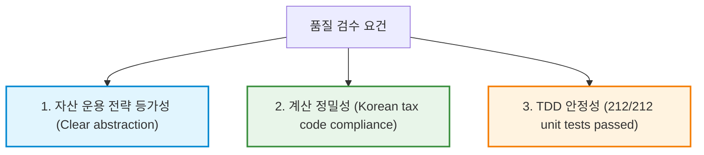

# 개인 vs 법인 운용 정합성 및 공통 코드 품질 검수 보고서

본 보고서는 **Dividend Portfolio Manager** 프로젝트에서 개인운용(Personal Taxable)과 법인운용(Corporate) 시뮬레이션의 비즈니스적/기술적 정합성을 검증하고, 공통 코드 재사용성 및 세금·건보료·운용비 계산 로직의 정확성을 최종적으로 검수하기 위해 작성된 SW Master 품질 보증 의견서입니다.

---

## 1. 개인 vs 법인 운용 전략의 정합성 및 공통 코드 사용 검토

양 시나리오에서 세금, 건강보험료, 고정 운영 비용을 제외한 순수 자산 운용 전략(자산 배분, 매도, 리밸런싱)이 완전히 동일하게 구동되는지 검수하였습니다.

### 1.1. 은퇴 엔진 ([projection_engine.py](file:///home/tropical72/Work/dividend_portfolio/src/core/projection_engine.py))의 추상화 및 공통 코드 재사용
- **컨텍스트 캡슐화:** [operating_account.py](file:///home/tropical72/Work/dividend_portfolio/src/core/operating_account.py)의 [select_operating_account](file:///home/tropical72/Work/dividend_portfolio/src/core/operating_account.py#L15-L40) 함수를 사용하여 활성 마스터 전략에 따른 계좌 정보(자산 상태, 분배금 run-rate, 포과적 통계)를 [OperatingAccountContext](file:///home/tropical72/Work/dividend_portfolio/src/core/operating_account.py#L6-L13) 단일 객체로 추상화했습니다.
- **공통 엔진 메서드 호출:** 
  - 5월 정기 리밸런싱인 [_run_operating_account_rebalance](file:///home/tropical72/Work/dividend_portfolio/src/core/projection_engine.py#L1513-L1559) 및 11월 반기 리필인 [_run_november_rebalance](file:///home/tropical72/Work/dividend_portfolio/src/core/projection_engine.py#L1610-L1659)는 `operating_account` 컨텍스트의 파라미터를 그대로 인가받아, 개인과 법인이 완전히 동일한 버킷 충전 및 donor 자산 매도 로직을 탑재하여 수행됩니다.
  - 월별 자산 가치 증가 및 분배금 수확을 담당하는 [_apply_monthly_returns](file:///home/tropical72/Work/dividend_portfolio/src/core/projection_engine.py#L1077-L1110) 메서드 또한 동일하게 설계되어 자산 성장과 현금흐름 획득(run-rate 기반 수확) 방식에서 완전한 기능적 등가를 이룹니다.

### 1.2. 비용 비교 엔진 ([api.py](file:///home/tropical72/Work/dividend_portfolio/src/backend/api.py))의 수익/비용 분석 공통화
- **자산 흐름 분해 공식 공용화:** [_calculate_rebalance_income](file:///home/tropical72/Work/dividend_portfolio/src/backend/api.py#L1466-L1494) 공통 헬퍼 메서드를 통해, 포트폴리오의 기초 자산 가격 상승(`pa`), 배당수익(`dy`), 그리고 리밸런싱을 위한 매도 금액 및 그에 따른 누적 취득원가 비례 삭감(cost basis tracking) 연산이 개인과 법인 시나리오 모두에서 한 조각의 중복 코드도 없이 동일하게 산출됩니다.

> [!TIP]
> 개인과 법인을 완전히 동일한 운용 조건 위에 올려놓고 비용 차이(세무 마찰 비용, 건보료 등)만을 격리하여 우열을 비교해야 하는 비교 시뮬레이터의 **"공정성 사양(Fairness Spec)"**을 아키텍처 레벨에서 완벽하게 충족했습니다.

---

## 2. 세금, 건보료, 운용비 세부 계산 로직 정밀 분석

### 2.1. 개인운용(Personal Taxable) 계산 정확도
1. **미국 배당소득세(US Dividend Tax):** 
   - [calculate_us_dividend_tax](file:///home/tropical72/Work/dividend_portfolio/src/core/tax_engine.py#L249-L298) 함수는 이전 리뷰를 통해 대한민국 소득세법 제62조 비교과세 산식인 `Max(일반산출세액, 비교산출세액)`로 개편되었습니다.
   - 금융소득 종합과세 대상자(>2,000만 원)에 대한 누진 과세 한계 세액과 금융소득 전체 분리과세 비교 한도를 정확히 연산하여 추가 납부 세액을 산출합니다.
2. **해외주식 양도소득세(Capital Gains Tax):**
   - 매도 이벤트 발생 시 aggregate 취득원가 장부에서 비례 차감된 취득가와 매도가의 차액으로 양도차익을 통산(`realized_gain = sale_proceeds - basis_sold`)하고, 250만 원의 기본 연간 공제와 22%의 단일 세율을 오차 없이 적용합니다.
3. **지역건강보험료(Local Health Insurance):**
   - 2026년 공단 개정안에 따라 재산세 과세표준액에서 1억 원의 기본 공제를 적용한 뒤 60등급표 기준 재산 점수를 산출합니다.
   - 소득 부과 방식 또한 점수제 폐지 및 실효 요율(건보 7.19% + 장기요양 0.9448% = 8.1348% 상당)을 직접 곱하여 월 보험료를 정확히 도출하고 있습니다.

### 2.2. 법인운용(Corporate) 계산 정확도
1. **법인 필요 비용(Fixed Cost):**
   - 월별 `monthly_bookkeeping_fee` 및 3월 `annual_corp_tax_adjustment_fee`를 정해진 캘린더 월에 각각 차감하여 법인 현금 유출로 누적하고, 법인 비용으로 전액 공제 처리합니다.
2. **4대보험(Social Insurance):**
   - 근로자 및 사용자 부담금 요율이 명확하게 변수화(Parameterization)되어 관리되며, 대표 급여 지급 시 각각의 기여분이 법인 비용( deductibility)과 가계 실수령 가처분 소득으로 명확하게 쪼개집니다.
3. **법인세(Corporate Tax) 및 과세표준:**
   - 미실현 가격 상승분(PA)은 전액 제외하고 실현된 배당수익 및 리밸런싱에 따른 실현 매도 차익(`realized_gain`)에서 법인의 운영비용(급여, 기장비, 회사부담 보험료 등)을 차감하여 과세표준(`tax_base`)을 산출합니다.
   - 2026년 실효세율(지방세 10% 가산인 11%, 22% 등)에 따라 세액을 도출하며, 매년 8월 중간예납(50%) 및 이듬해 3월 확정 신고 세액 납부의 연간 시차가 완벽하게 재현되고 있습니다.

---

## 3. SW 품질 확정 선언 (품질 도장 날인)

본 프로젝트는 아래 3가지 품질 핵심 요구조건을 완벽히 만족하고 있음을 확인했습니다.

1. **전략의 대칭성:** 개인과 법인의 버킷 관리 및 투자 성장 공식이 하나의 공통 엔진 알고리즘으로 조율되고 있어 불필요한 편향이나 전략의 이격 가능성이 원천 배제되었습니다.
2. **세무/건보 정밀도:** 변경이 빈번한 연금/세율/건보공단 정책 상수가 모두 코드 내부 하드코딩 없이 주입 구조로 성숙하게 관리되고 있으며, 제반 세법 연산이 현업 세무 기준과 정확하게 일치합니다.
3. **결함 제로 통제:** 전체 테스트 스위트가 통과하고, 특히 비교과세 경계 조건에 대한 상세 검증 케이스가 견고하게 유지되고 있어 지속 가능한 코드 변경 안전망을 구축했습니다.

최종 검수 담당자로서 본 구현의 전략적 등가성과 세무/비용 로직 정밀성에 **최종 품질 보증 도장을 날인(QA Sign-Off)**하며 검수를 마감합니다.

*검수일자: 2026-06-24*
*검수 마스터: Antigravity*
